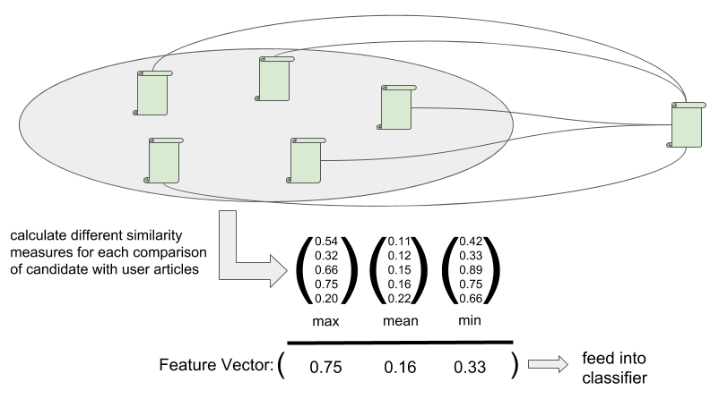

# ML4NLP - Gamma

## Introduction (Week 1)
News recommendation is a commonly tackled task in natural language processing. In our era of massive sources of information available, the appropriate pre-selection of candidates matching the specific interest of a user is a crucial task. Both the user and the providing platform profits from such a system, as users whose needs are fulfilled may stay longer in such an environment. Given its purpose, news recommendation may be seen as an instance of classical Recommender System. According to Ricci et al. (2010), such a system is composed out of three basic components:

- User: A user is an entity having an interest in consuming items given its special preferences.
- Item: A product is an entity from a set, which is chosen by the system for best matching the preferences of a user. In our case, these items are news articles.
- Preferences: A preference is a feeling of a user regarding an item, commonly described as likes and dislikes.

Many current websites use such systems for different modalities. Examples are the selling of products (i.e. Amazon), the recommendation of movies and series (i.e. Netflix) or the providing of somewhat pleasant, interesting or funny posting (i.e. Facebook).

### Project goal
The goal of this project is to implement a news recommendation system based on articles of the free-content news source Wikinews (https://www.wikinews.org/). As the data base we will use KnowledgeStore (https://knowledgestore.fbk.eu/), in which entities and events from Wikinews have been extracted and which is enriched with knowledge from dbpedia (https://wiki.dbpedia.org/). 

With the help of SPARQL (https://www.w3.org/TR/rdf-sparql-query/) and the KnowledgeStore API (http://knowledgestore2.fbk.eu/nwr/wikinews/ui) we will access and extract knowledge from this data base to easily gather the data for our news recommendation system in a computer readable format.

### General approaches
In order to understand the design decisions of our project, we sill shortly introduce the main idea of popular approaches for Recommender Systems. In generel two popular approaches can be distinguished. A list of recommendations can be gathered either by
applying collaborative filtering or by applying content-based filtering.

In the collaborative filtering approach, recommendations are selected by collecting and comparing information and preferences from multiple users. The underlying assumption is that if a person A has the same interest as a person B, the person A is more likely to have person B's interests than that of a randomly chosen person. Pure collaborative filtering approaches do not exploit or require any knowledge about the items themselves. An advantage of this strategy is that these data do not have to be entered into the system or maintained.

In the content-based filtering approach, the descriptive attributes of items are used to make recommendations. The goal is to recommend items to the user that are similar to those that a user liked in the past. So at its core, content-based filtering is based on the availability of (manually created or automatically extracted) item descriptions and a profile that assigns importance to these characteristics. An Advantage of this approach is that it does not require large user groups to achieve reasonable recommendation accuracy. Moreover, new items can be immediately recommended once item attributes are available. In some domains these item descriptions can be automatically extracted or are already available in an electronic catalog. In other domains some of these characteristics are hard to acquire automatically. In that case such information must be manually entered into the system.

Both approaches can be combined into a hybrid approach, which then could be more effective in some cases. But due to a lack of user information, we would have to enter all the user data manually to use elements of a collaborative filtering approach. Given the established rules of statictics and data science, a tremendous amount of fake data would be needed for finding such intrinsic relations. As an alternative, in the content-based filtering approach, we can use SPARQL to extract automatically the pre-annotated characteristics of our news articles. Only the preferences of the user have to be simulated from us manually.

### Classifier design
Given the complexity of the task, we decided to stick to the content-based filtering approach in the beginning. In order of implementing such a news recommendation system utilized supervised machine learning, we have to define our goals. In a nutshell, we define our task as approximating an unknown function *f*, which gets the preferences of a user and an article as input and returns a score indicating the predicted interest of the user for that article. Iterating through the set of news articles and evaluating the function multiple times, such an implementation would find the most relevant articles from a corpus.  

For acquiring the required data, we have to simulate some user with specific preferences. This data will be utilized both as training and testing data. In a next step, the viewed articles will be used to extract a representation for the preferences. This preferences will afterward be used to train the second classifier mentioned above.

## Dataset (Week 2)

Given the aims of the project and its design as a supervised classification task, the data as input is a crucial part of the system. In the case of a recommendation task, the preferences of the user may be considered as the significant information. In general, we might have two different ways of representing it, independently if we want to focus on collaborative or content-based approaches mentioned above:
- In a "direct measurement", we measure the preferences of the users by asking for their opinion towards the items. The actual modalities of this process are not specified. Therefore, we may use setups like binary like-dislike questions or grading scales. While the direct communication and instruction with the participants may result in high-quality data, the approach scales not well. The users may have to spend their time actively and need therefore to be recruited.
- "Indirect measurements" take an alternative approach: By observing the behavior of users in their normal environment, one may be able to draw some conclusions. Especial in the contexts of popular websites, that is a commonly utilized approach. By using indicators like duration of stay or interacting behavior, the preference of a visitor may be concluded. Such an approach scales extremely well with the number of users who may not even recognize they are currently tracked. On the other side, such an approach adds a tremendous amount of noise due to its uncontrolled nature: A user may abort reading a newsletter article because she or he is distracted or his or her current mood does not match his or her general preferences.

Both approaches have advantages and disadvantages which have to be considered during the plan of the experiments. Like commonly in data science, it is a classical weighing between small amounts of high-quality and colossal amounts of rather noisy data where both may come from a specific distribution. In this project, we will stick to the firstly formulated type of measurement due to different reasons. First of all, we have no access to an existing news website as a potential source of user data. Especial under the influence of modern data protection laws, a collection of extensive amounts of data seems not to be possible. Without having to care about the intrinsic noise of the data, one may focus more precisely on the actual goal of the experiment. In order of acquiring high-quality data, we stick therefore to explicitly annotated preferences. As the topics of interest will be rather high level in our setup, we have even the opportunity to utilize artificially generated data. Given broad and mutable exclusive categories of interest, we may simulate "ideal" user.

In order of encoding the preference in our setup, two different ways of a binary code seem reasonable. On the one hand, we may annotate both "likes" and "dislikes" regarding a set of articles. On the other hand, we may create exclusively a set only with articles of interest and considering everything outside as "not of further interest". As it may simplify later the introduction of noise while keeping the data management simple, we will stick to latter way.

Summarizing these design decisions, we utilize a hybrid approach by combining a pre-existing set of newspaper articles with artificial users with "expert-made" yet idealized preferences:

1. A collection of mutable exclusive topics of newspaper articles is defined by human experts (i.e. "Porsche car", "Mid-elections in the US").
2. Human experts assign a number of newspaper articles to each topic.
3. A massive amount of artificial users are generated by assigning different topics of interests to them. 
4. During training, a subset of the articles of each category is randomly selected and trained to result in a match regarding another article of the category. Furthermore, newspaper articles from other categories are utilized to train the binary classifier regarding a negative response.
5. For evaluation purposes, articles of each category not used in training are evaluating if being correctly classified.

This approach allows covering a large number of desirable properties of a dataset. Due to its artificial nature, a large amount of data can be generated effortlessly. The quality of the data is sound while being clearly documented. Probably, the biggest source of potential trouble is the representative nature of the data regarding the "real world". A careful selection of an extensive set of appropriate topics with assigned newspaper articles is necessary.

## Source of the dataset (Week 3)
After defining the general approach, the next step consists of evaluating which kind of dataset might be suitable for the proposed method. We need to define the exact source for our samples. Our first starting points were the annotated samples provided by the KnowledgeStore. Nevertheless, given its publication date and the commonly rather rapid development of popular web pages, we decided, that it might be worth trying to obtain more samples as the annotated ones by accessing Wikinews directly. 

Wikinews differentiates between categories and articles. One category can have zero, one or multiple subcategories. The subcategories are normal categories as well and can have zero, one or multiple subcategories on their own again. An article can be assigned to every category. Every category may have multiple subcategories and articles assigned simultaneously. The category "Music", for example, has both the subcategories "Blues music", "Classical music", "Heavy metal" etc. but also multiple articles, e. g. "US rapper Mac Miller dies at home in Los Angeles" or "Netta wins Eurovision Song Contest for Israel" assigned. Given this hierarchical structure, a representation as a tree-like structure seems suitable to represent the data.


For querying all the actual data, two ways seemed possible and were evaluated. The foundation for all our experiments was an object-orientated pipeline written in Python allowing a flexible parsing, filtering and storing of both categories and articles. The classes may be found in the file "ArticlesExtractor.ipynb".

- As a first approach, Wikinews offers its own page, where every category and the number of assigned news articles to each category are listed (https://en.wikinews.org/wiki/Special:Categories). Unlike one may expect, this page is automatically generated by the underlying MediaWiki-System. As an implication,  the list contains not only categories but also a high amount of noise: The pages of specific users and authors are included beside "Meta-categories" like "Corrected Articles" or "Templates".  Besides the actual parsing, a high amount of work was employed to define filters for such outliers. Utilizing more than 30 different regular expressions both for categories and articles, we defined a rather stable subset of valid entities. Nevertheless, fearing pollution and a drop in quality we do not follow this approach. 

- As a second approach, we defined a set of "top-level" categories and created the structure recursively from those. We oriented us both on the categories proposed by Wikinews and the one embedded into the KnowledgeStore. As these pages do not include any metadata, we do not apply any additional filtering.

Despite our effort, the extraction process does not lead to a potentially valuable amount of additional data. In comparison to the 19737 annotated articles in the KnowledgeStore, the 27657 articles available nowadays were not considered as justifying a complete hybrid pipeline of both sources, at least not during our first experiments. We will stick to the available categories in the KnowledgeStore in order of generating the preferences of our user.

## Generating the dataset (Week 4)

### Preprocessing
After we spent some time on the analysis of the articles and categories provided by WikiNews and the Knowledgestore during the last week, we implemented the necessary steps to generate our dataset for the classifier in this week.

As a first step, we extracted the URL of every article existing in the Knowledgestore. Given the identifier of all the 19737 articles stored there, the object-orientated structures developed in the last week were utilized to enrich them with additional information. Utilizing the API of the underlying software *MediaWiki* and a JSON parser, we extracted both the human readable title and the list of matching categories. Despite our multiprocess-based parallel parsing pipeline, this enrichment took a significant amount of time. In order of simplifying the development and using the available resources in a fair manner, these data was cached locally in the file *articles.pickle*.

In the next step, we optimized the data layout of these articles regarding the following tasks. Utilizing a dictionary-like structure, a mapping of all available categories towards their included articles were generated. Under usage of the hashing functionality of Python we ensured that the same category is not saved multiple times while still having access towards an easy iterating, filtering and mapping of the data. In total, we obtained 5833 different categories with all the available articles. 

As already described in the previous week, the resulting categories do not all represent information of further interest. Especially categories like  "Corrected Articles" or "Audio reports" do not make any sense for a news recommendation system. Utilized all the hand-designed regular expressions, the already obtained categories where therefore filtered in a third step.


By inspecting the 2408 remaining categories with the most influential ones visualized above, we were able to ensure the correctness of our approach. Still, we did not defined our lower required border for the importance of a news category. Small categories might carry no information of representative nature and do not allow an efficient training procedure due to their small amount of articles. In the next step, we analyzed therefore the distribution for figuring out, how many articles should be enforced for a valid category.


Given the sufficient amount of categories with a rather high amount of categories, we saw no special need to face the problems resulting from tiny categories and decided to filter out every category with less than five articles. Finally, the resulting number of obtained categories used from now on is therefore 1612.

### Generate dataset
Interpreting these categories as potential interests of a news readers, the implementation of the pipeline for the actual generation of training data is rather straightforward. Fundamentally, every user is an instance of the class *User* with a specific amount of different interests. From each of these users, multiple user representations might be randomly drawn. These representations consists out of a list of articles considered as interesting for the user and are utilized as the first part of input to the classifier. The second part if the input is a single articles, which the classifier has to classify as "interesting"  or "not interesting" finally. In order to generate such positive and negative samples, the class *User* supports methods for getting articles with one of these known binary labels. A set-theoretically inspired implementation ensures that subcategories are handled in a correct manner when drawing negative samples. 


Finally, we are now able to generate positive or negative labeled training data for individual user. The fundamental idea behind training is to generate a enormous amount of users, probably even on-the-fly, during our training process and train our classifier on their representations. Due to the combinatorics of assigning random articles to users, we can generate an incredible amount of training data. For validation purposes, we might utilize a subset of users with interests not used during training. Below, you find an example representation generated by the system for an user with interests in Dubai and Nicola Sturgeon:

```
Example user representation (Interests: Dubai, Nicola Sturgeon):
			 "Emaar Properties claims Burj Dubai as world's tallest building"
			 "Elderly man in Scotland dies after contracting H1N1 swine flu virus"
			 "Dubai purchases RMS Queen Elizabeth 2 for $100 million"
			 "40th H1N1 swine flu death recorded in Scotland"
			 "SNP wins Glasgow East by-election in Scotland"
			 "Two charged in Heathrow bomb threat"
			 
Interesting:
			"George Bush arrives in Saudi Arabia as part of his Middle East visit"

Not interesting:
			"U.S. Senator Larry Craig to resign"
```

## Finalize the dataset (Week 5)

Last week we implemented the single functions to generate our dataset. What was still missing are functions, that completely generate our training and testing dataset in one run. Moreover, we want to save the generated dataset locally in a pickle-file. This is a necessary task to document our dataset and with it, we are allowing to be able to access it later and to recognize, on which data our classifier was trained.

### Setup (How to ...)
This week it was asked, whether we can include a little part on the setup of our codebase in our documentation. In the whole project, we will use Python 3 as our programming language (https://www.python.org/). Our plan is to first use IPython Jupyter Notebooks  (http://jupyter.org/) for a quick prototype and for a first implementation and visualization of our ideas (file ending is ".ipynb"). After testing our prototypical implementations and splitting up the code into modular parts, we then extract them into normal Python-Files (file ending is "py"). These Python-Files can then be easily accessed by our IPython Jupyter Notebooks or by other Python-Files.

In order to run the code, you have to install Python 3 on your local computer. We recommend installing Python 3 via Anaconda. You can download Anaconda here: https://www.anaconda.com/download/. In order to install Anaconda, please follow the guidelines on this website: https://conda.io/docs/user-guide/index.html.

Furthermore, we recommend using different Anaconda environments for different projects (more information on this website: https://conda.io/docs/user-guide/tasks/manage-environments.html). After you have installed Anaconda (and Python 3 with it), you are now ready to run the Python files in your terminal (just type "python" and then your desired Python file to execute in the command line). Alternatively, you can use different Integrated Development Environments (IDE) to run the Python files(https://wiki.python.org/moin/IntegratedDevelopmentEnvironments).

In order to run and look into the code of the IPython Jupyter Notebooks, you have to install Jupyter Notebook on your local computer. Luckily, if you have installed Python 3 via Anaconda, you already should have Jupyter Notebook installed. Nonetheless, if you use different Anaconda environments, you should install it for your corresponding environment as well. For installing it in a certain environment just open the command line, activate your environment and type in: "conda install jupyter". You can run Jupyter Notebook by typing in "jupyter notebook" in your command line. Then your browser should open and you can choose the IPython Jupyter Notebook file, you want to open in the browser.

### Possible Hyperparameters
This week, we thought about the hyperparameters that can be tuned to generate the dataset and to feet the dataset into the classifier. With tuning these hyperparameters we are able to generate different kinds of datasets and therefore we can explore, which dataset and which training hyperparameters will improve our classification accuracy in the future. The possible hyperparameters are:

- number of articles in the user representation (depends on the minimum number of categories)

- number of interests (categories) of one user (could be flexible or a fixed amount of categories for each user)

- number of internal users

- number of user representations per user

- "Batch-size": number of positive and negative labels per user presentation

- splitting categories in training and test dataset (do they have the same categories or different ones?)

### Restructuring the code
Due to these hyperparameters and for an efficient way to create our dataset, we thought it is perhaps a good idea to restructure the code a little bit. 

For the user representation that we feed into our classifier, we created the class Representation. This class takes in the parameters number articles per category, the number of positive samples and number of negative samples. In the next step, we created a User class. This class represents our internal user. It can be controlled by the parameters number of interests, number of representations and all the parameters of the representation class. Finally, we implemented a Dataset class, which is responsible for generating the data set (and in the future for saving it in a pickle- or csv-file). The Dataset class gets the parameters number of user and all the parameters of the User class. To handle all hyperparameters in an efficient and central way, we created for each class the subclass Parameter. This allows us to reuse the parameters and feed them into our three different classes efficiently.

This is an example for a dataset with the hyperparameters articles_per_interest = 1, positive_samples = 3, negative_samples = 1, representations = 1, interests = 2, users = 1:

|   interest 1   |   interest 2   |article_interested 1         |article_interested 2               |candidate                 |label|
|----------------|----------------|-----------------------------|-----------------------------------|--------------------------|-----|
|   Baltic Sea   |     Sony       |Aggressive Bird Flu found ...|American console sales continue ...|Warming oceans make it ...|True |
|   Baltic Sea   |     Sony       |Aggressive Bird Flu found ...|American console sales continue ...|Snow causes German ...    |True |
|   Baltic Sea   |     Sony       |Aggressive Bird Flu found ...|American console sales continue ...|Sony's Playstation ...    |True |
|   Baltic Sea   |     Sony       |Aggressive Bird Flu found ...|American console sales continue ...|University defeat Maro ...|False|

Finally, we are now able to create a list, which contains the internal categories (interests) of a user, the user representation for the classifier and the labeled examples in one row. As mentioned above, we want to save this generated dataset in a pickle-file, so that further researchers can just read it in into their code. We did not implement this yet, because we are not sure, which data is exactly necessary to save in order to split it into a training and a test dataset. But after we know more about our training and test data split and about our classifier, we will surely implement this.

## Evaluation and Baselines (Week 6)
### Dataset split
After the creation of our dataset, reasonable evaluation metrics and baselines for our model were evaluated. In order of obtaining unbiased results in the end, these factors of final applicability were defined a priori. A special focus was put towards the fact that the classifier should not only be able to classify on the generated dataset as good as possible but generalize well on unseen data, too. An evaluation of the complete dataset would not result in some usable information regarding the latter intent. Therefore we introduce a split of our dataset into a training set, a validation set, and a test set. The training set is used for training the algorithms while the test set is used to measure the generalization of the classifier on unseen data. By using a specialized validation set, we ensure that not even the choice of hyper-parameter might leak training information into the final evaluation.  Due to the automatic generation of our dataset, we have an enormous amount of data available for training purposes. Although we will split up our entire dataset into different parts and therefore reduce the size of the individual data sets, we still have a high amount of samples sufficient for training, validation, and testing. Especially for smaller datasets, a classical cross-validation approach might be a suitable alternative in related literature. Nevertheless, given its downside regarding its complexity due to the multiples and possible costly pieces of training of the same classifier and the available amount of data, we stick to the simpler approach. In summary, a simple shuffling and splitting of the dataset into the above mentioned three parts seems to be the optimal solution for our use case.

In the first run, we consider an 80% - 10% - 10% split, i. e. 80% of our dataset will be the training set, 10% the validation set and 10% the test set. That allows us to train our model still on a large size of training samples while keeping a sufficient amount of samples for validation and testing. As these splits are flexibly defined as another simply settable hyperparameter of the experiment, during the course of experiment multiple different versions might be evaluated.

### Evaluation metrics:
For evaluating the performance of our model, different applicable metrics were compared. Each of the metrics can be computed by the values of the so-called confusion matrix. This confusion matrix consists of four different numbers classifying the predictions into the four possible outcomes of True positive, False positive, False negative and True negative classified samples.


The following metrics can be taken into account in order to measure the performance of our model:

Accuracy: 

<a href="https://www.codecogs.com/eqnedit.php?latex=\frac{(TP&space;&plus;&space;TN)}{(TP&space;&plus;&space;TN&space;&plus;&space;FP&space;&plus;&space;FN)}" target="_blank"></a>

False Alarm Rate:

<a href="https://www.codecogs.com/eqnedit.php?latex=\frac{FP}{(FP&space;&plus;&space;TN)}" target="_blank"></a>

False Negative Rate:

<a href="https://www.codecogs.com/eqnedit.php?latex=\frac{FN}{(FN&space;&plus;&space;TP)}" target="_blank"></a>

Precision:

<a href="https://www.codecogs.com/eqnedit.php?latex=\frac{TP}{(TP&space;&plus;&space;FP)}" target="_blank"></a>

Recall:

<a href="https://www.codecogs.com/eqnedit.php?latex=\frac{TP}{(TP&space;&plus;&space;FN)}" target="_blank"></a>

F1-Score:

<a href="https://www.codecogs.com/eqnedit.php?latex=2&space;\cdot&space;\frac{(Precision&space;*&space;Recall)}{(Precision&space;&plus;&space;Recall)}" target="_blank"></a>

Cohen's Kappa:

<a href="https://www.codecogs.com/eqnedit.php?latex=\frac{(p_0&space;-&space;p_e)}{(1&space;-&space;p_e)}&space;\&space;where&space;\&space;p_0&space;=&space;Acuraccy&space;\&space;and&space;\&space;p_e&space;=&space;\frac{(TP&space;&plus;&space;FP)}{(TP&space;&plus;&space;FP&space;&plus;&space;FN&space;&plus;&space;TN)}&space;\cdot&space;\frac{(TP&space;&plus;&space;FN)}{(TP&space;&plus;&space;FP&space;&plus;&space;FN&space;&plus;&space;TN)}&space;&plus;&space;\frac{(FN&space;&plus;&space;TN)}{(TP&space;&plus;&space;FP&space;&plus;&space;FN&space;&plus;&space;TN)}&space;\cdot&space;\frac{(FP&space;&plus;&space;TN)}{(TP&space;&plus;&space;FP&space;&plus;&space;FN&space;&plus;&space;TN)}" target="_blank"></a>

In the case of a recommendation system, we are especially interested in the fact of how good we can predict interesting articles for specific users. Therefore we will look especially in detail on the accuracy, the False Alarm Rate, and the precision. The accuracy indicates the overall performance of our model and the amount of correctly classified articles. Therefore, it should be as high as possible in our approach. As we will demonstrate later, for a reliable measurement a balanced dataset is necessary.  Both other metrics are of special semantic interest. On the one hand, the False Alarm Rate indicates how many articles the system recommends to a user being not of further interest for him or her. Minimizing the value is, therefore, a crucial part of the training process. On the other hand, the precision designates how many of the articles recommended by the model are of further interest for a user. This measurement should, therefore, be maximized.

### Baselines
As simple baselines, we will use the "Always True"-Baseline (predicting all articles as interesting for a user) and the "Based on Label Frequency"-Baseline (predicting articles as interesting for a user based on the distribution of our dataset). Assuming the first dataset with a total amount of 960 samples in the training set and 120 samples in the training set as well as a label distribution between positive and negative articles of 50% - 50% the accuracy, the False Alarm Rate, and precision will result in the following values:

#### "Always True"-Baseline:
 - Accuracy: 0.5
 - False Alarm Rate: 1
 - Precision: 0.5

#### "Based on Label Frequency"-Baseline:
 - Acuraccy: 0.5
 - False Alarm Rate: 0.5
 - Precision: 0.5

For a final evaluation, we will compare the results of potential classifiers in the future with these metrics to these baselines. This comparison should allow us to evaluate in an objective manner, how good our news recommendation system finally will be in predicting interesting articles for different kind of users.

## Feature Engineering I: Feature Extraction (Week 7)
### Feature Extraction
The foundation of any processing of real-world data with machine learning is the extraction and processing of features. As the data may be seen as commonly high-dimensional and noisy samples of an unknown distribution, their complexities have to be reduced and converted into a numerical representation computer may effectively deal with. This process called "feature extraction" is especially necessary when dealing with sequential (i.e. audio, text) or spatial (i.e. images) data. Unlike many current approaches, where members of the flexible class of neural networks are used for a combination of both feature extraction and prediction, we separate both steps in our first experiments. Since our dataset consists of user representation described by interesting and not interesting texts, our first goal is to represent a complete article as some kind of a feature vector. 

The hardest challenge emerges from a simple observation: While a text is by definition a sequence of an arbitrary number of words, we have to provide a fixed set of features to the machine learning algorithm we want to use. That fact limits us to a fixed amount of features for each article, while it is not guaranteed that each article has these features. Moreover, we might not be good in generalizing to unseen articles, since we can only define the features for our known dataset. In order to tackle these difficulties, we thought about two different sources of features, which might be used together or separately:

Our first approach utilizes the semantic knowledge included in the Knowledgestore. Commonly, news article describes the behavior, status or actions of specific entities. These proper nouns might be elements like politicians, companies, or countries. In order to extract the essence, we would extract the most important proper nouns of our whole dataset and relate them to the semantics that the KnowledgeStore provides to us. For instance, if the word Trump, Merkel and Macron are very important, we would relate these word with the help of the KnowledgeStore to "Politician". Based on this procedure we would end up with a fixed list of high-level features for each article. Our classifier would then learn, in which combinations of this high level features the user is interested in. New samples would be classified based on this high-level features. As already mentioned above, a disadvantage of this approach is that we have to stick to a fixed amount of categories. Problems in classifying unseen samples could arise because it is not guaranteed that every sample has the features we have defined based on our given dataset. The possible values here for our feature vectors of different articles would be an array consisting out of boolean values, whether a high-level feature exists in the article or not. They target positive as well as negative examples.

Due to the mentioned shortcomings, we thought about another source of possible features providing a more "flexible" description for different articles. After focussing on the actors in the first approach, this time their context are considered. By analyzing the background of the actual actions, one may build an appropriate representation. In the first step, the most important words of an article are extracted. The actual implementation of this procedure might vary: A common approach might be the usage of the TF-IDF-score for gaining the *n* most important words, but unlike the first approach we are not constrained by a fixed number *n*. For making this possible, we utilize a  second step: Employing the mappings provided from models like Word2Vec, we can map the candidates to a fixed length vector. As these mathematical representations describe the semantic and syntactic relation between words, we may actually calculate with them. Learning kernels is exactly as possible as using simple averaging for reducing *n* vectors to a single one. Therefore, in the end, we can handle an arbitrary number of words for gaining the fixed-sized feature vector.

Unfortunately, the implementation of these approaches suffered from the rather unstable KnowledgeStore. While the data structure of the articles was extended to represent and store both the text and the mentions locally, a loading was not possible due to endless responses of the server at "http://knowledgestore2.fbk.eu/nwr/wikinews/".

## Feature Engineering IV: Finalizing (Week 10)

### Challenge:
Earlier in the project, we decided to represent a user as a list of articles. Our classifier then should determine, whether another labeled article (interesting or not interesting) belongs to this user or not. This implies, that our features have to encode somehow a similarity measure between the user representation and the "new" labeled article. Since we have chosen a more complex representation of one user (instead of for example just a list of topics the user is interested in), we have to aggregate the different articles of the user representation to obtain such a feature.

### Feature Extraction:
The basic idea can be seen in the image below. We compare the labeled article with each of the n articles of the user representation. From this, we obtain n different values. The final feature vector is then represented by taking the maximum value, the minimum value, the mean value, the median value, the variance and the standard deviation of the n different values.



To compare the articles to each other, we use three different approaches:

#### 1. Word-Embeddings-Similarity

For this approach, we extract the Word Embeddings for every word in the articles, so that we obtain a vector of word vectors for each article. We then reduce each word vector to a single number by taking the mean. Now we have for each article a numeric vector consisting out of the mean values of the word vectors. The single articles can now be compared by taking the cosine similarity of the numerical vectors. In the end, we obtain for this approach one feature vector consisting out of six entries (max, min, mean, median, variance, standard deviation).

#### 2. TF-IDF-Similarity

In the first step, we calculate the TF-IDF score of the whole vocabulary of our training corpus. This results in a very high dimension, so we limit this dimension by just taking 1000 words with the highest TF-IDF score over out entire training corpus. Based on this we end up with a numerical vector with 1000 entries for each article. The single articles can now be compared by taking the cosine similarity
of the numerical vectors. In the end, we obtain for this approach one feature vector consisting out of six entries (max, min, mean, median, variance, standard deviation). 

#### 3. Named-Entity-Similarity

Using the spacy-API (https://spacy.io/usage/linguistic-features), we extract for each article the following named entities: ```PERSON``` (People, including fictional), ```NORP``` (Nationalities or religious or political groups), ```ORG``` (Companies, agencies, institutions, etc.), ```GPE``` (Countries, cities, states), ```EVENT``` (Named hurricanes, battles, wars, sports events, etc.). From this, we get a list of named entities for every article. We lemmatize these lists of named entities per article so that we end up with the word stems, and then we build the set. Now we are able to compare each set to each other set by taking the Intersection over Union. In the end, we obtain for this approach then five feature vectors (for each named entity) consisting out of six entries (max, min, mean, median, variance, standard deviation).

### Test run:
For a first test run, we concatenated all of these feature vectors and trained a simple random forest classifier on it. We obtained the following quite promising values for the beginning: 

F1-Score: 0.8654970760233919

Accuracy: 0.8083333333333333

Precision: 0.891566265060241

|     | T  |  F |
|-----|----|----|
|**T**| 23 |  9 |
|**F**| 14 | 74 |

# Feature and model selection (Week 13)

After the generation of the available features, the machine learning circle finally enter the actual stage of selecting those, training a classifier on them and evaluate the results. At last at this point, the careful creation of the dataset provided an astonishing simplification. Common problems in machine learning like imbalanced and missing data where excluded by design.

In a direct correlation with the complexity of the complete pipeline, the number of available hyperparameters grows enormously. In order of finding optimal solutions for a problem, commonly a systematic search and evaluation of different parameter constellations is necessary. Multiple ways are imaginable. Naively, one may optimize for one hyperparameter after the other. While this sounds usable in theory, in practice it suffers from the relation between the hyperparameters. As one former bad parameter may reveal itself as superior in combination with the following hyperparameter, such a greedy search for the best hyperparameter may get stuck easily in local optima. Being aware of this danger, one may instead simply optimize regarding all available permutations of all hyperparameter. This so-called grid search has the advantage of an intrinsic guaranty to find the best constellation. Nevertheless, it requires to really evaluate all different constellations which might result in infeasible time constraints. More sophisticated solutions tried to tackle this constraint, i.e. by introducing some factor of randomness for covering the complete feature space in an efficient manner.

From our point of view, this selection of hyperparameter does not start with the hyperparameter of the actual classifier. Instead, the complete pipeline of preprocessing the features, selecting them, choosing a machine learning algorithm and training it with respect to some hyperparameter appears to be a feature space itself. Especially when constraining ourselves to rather fast-training classifiers, even a complete grid search seems possible. As a direct implication, we are able to guaranty the best possible detection from a carefully selected set of transformations and classifiers.

Therefore, in the end, our pipeline consisted out of three different steps:

1. In the step of feature preprocessing, we included both the methods of leaving the features as they are or scale them according to their mean and variance. Some classifiers like k-neighbors or SVMs being dependent on direct distances between features are sensible for the range of the data they are applied on.
2. In the step of feature selection, we included both methods of leaving the features as they are or apply a PCA on them. The output dimension of the PCA itself was chosen from a set including 5, 10, 15, and 20 dimensions. In the beginning, we planned to add a selection algorithm on the base of the chi^2 criterion, which was unfortunately unable of dealing with the negative differences which occurred sometimes.  For the sake of simplicity, we, therefore, do not transform the data before but leaf it out.
3. For the actual classification, we included approaches from the complete domain of different machine learning theory. Beside Decision-Tree-based approaches like Random and Extra Forest, we included Naive Bayes, Gaussian Processes, Quadratic Discriminant Analyses, K-Neighbors Classifier, and support-vector machines as the classifier.

For all steps in the pipeline, the sci-kit-learn implementations are used. Especially the provided utilities for Grid searches are rather handy but are not completely capable of representing our conceptualized pipeline. While it is possible to evaluate different types of transformers, those cannot be tested with different individual hyperparameters. Therefore, we implemented an auxiliary function generating the classifiers of the same type with all permutations of available parameters.

# Results
TODO

### Citations
Aggarwal. (2016). Recommender Systems: The Textbook. Springer

Jannach, Zanker, Felfernig, Friedrich. (2011). Recommender Systems: An Introduction. Cambridge University Press

Ricci, Francesco & Rokach, Lior & Shapira, Bracha. (2010). Recommender Systems Handbook. Springer
